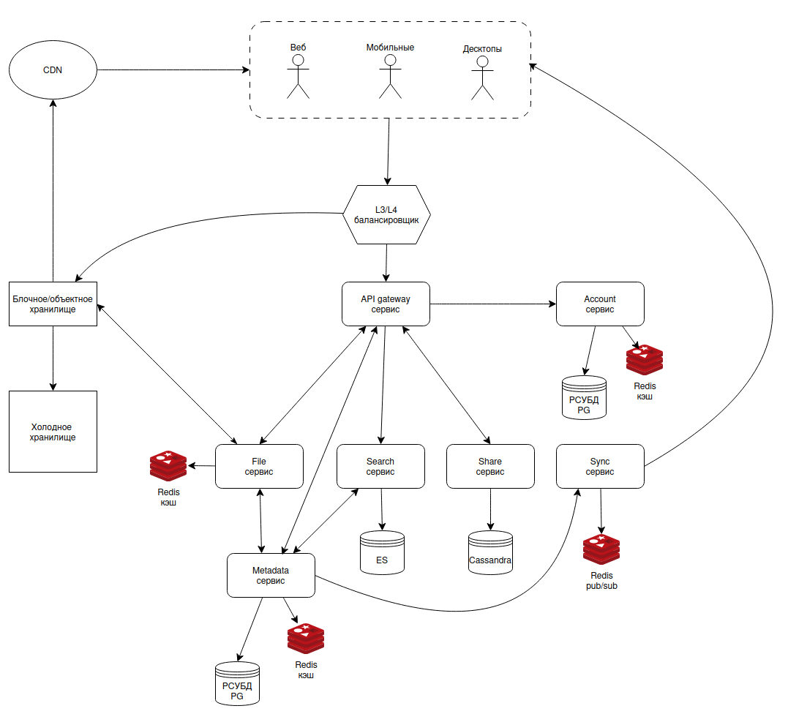
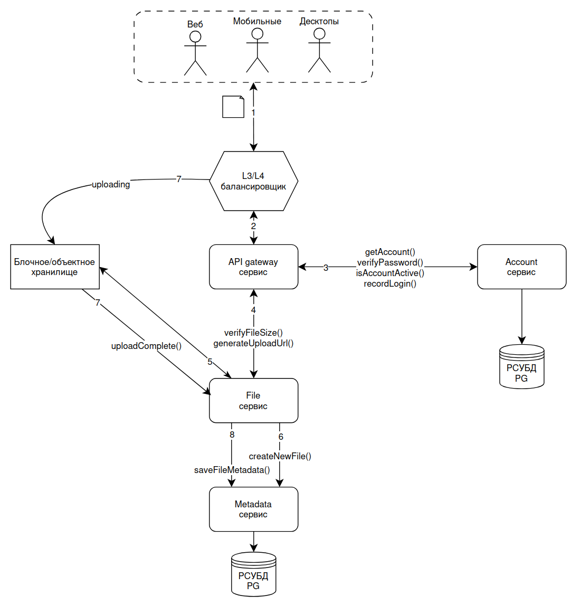
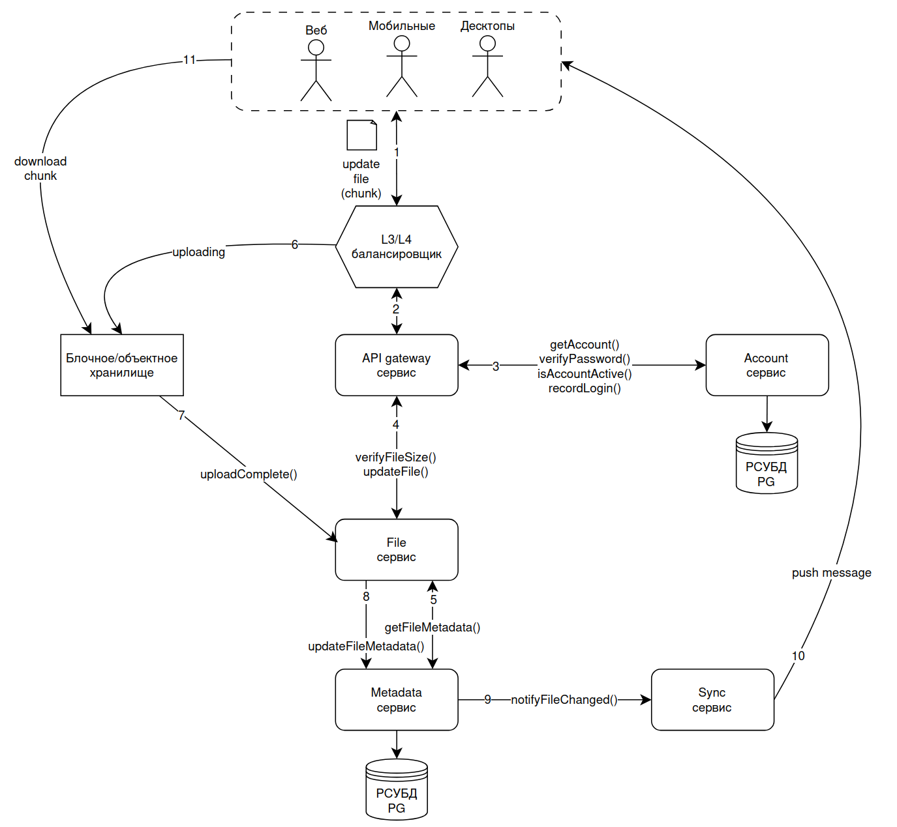
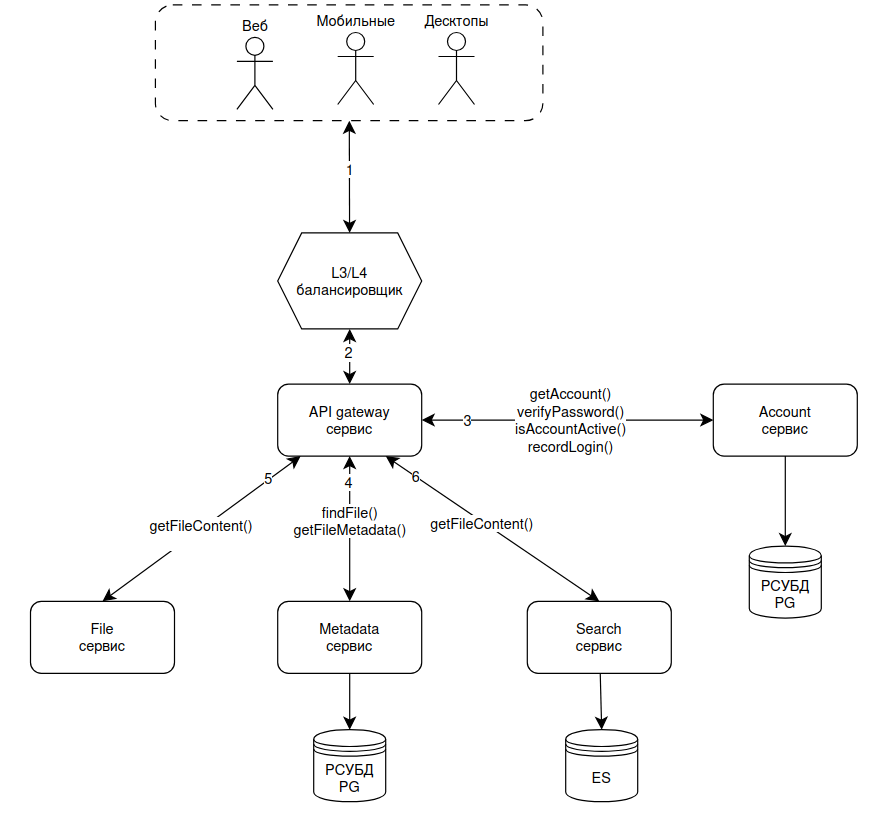

# ДЗ 1. Анализ референсной архитектуры — решение

## Выбранная архитектура

Облачное хранилище

Система реализует сервис хранения пользовательских файлов произвольного размера и формата. Сервис обеспечивает надёжное и безопасное хранение файлов, синхронизирует их между несколькими устройствами пользователя и способен быстро отдавать (позволять скачивать) файлы вне зависимости от географического расположения пользователя.

Целевая аудитория:

- **одиночные** пользователи (хранение личной информации);
- учащиеся (школьники/студенты обменивающиеся учебными материалами, **небольшие группы** от 2 до 20);
- корпоративные клиенты (потенциально **большие группы** пользователей от 2 до 200 человек, которые совместно работают над файлами и/или обмениваются ими).

Ключевые сценарии использования:

- пользователь загружает статический (изменение не предполагается) файл для **долгосрочного хранения и периодического просмотра** (например, личные фотографии с важного события в жизни или резервные копии контактов из смартфона);
- пользователь осуществляет **поиск** файла с неизвестным именем, но с приблизительной датой его создания в хранилизе (поиск фотографии из давнего путешествия);
- группа пользователей скачивает загруженный кем-то одним статический файл (**шаринг** информации внутри компании или среди студентов, например, преподаватель делится дополнительными материалами по лекции или руководитель отдела делится готовым отчетом);
- компания имеет офис в Москве и производство Владивостоке, каждый день производство загружает большой отчет (таблицу) о количестве произведенных товаров, а офис в дополнительном столбце проставляет номер ячейки для хранения этого товара (**множественые мелкие изменения в большом файле**);
- пользователи фиксируют фото и видеоматериалы на мобильных устройствах, загружают в хранилище и получают **синхронизированный** результат на домашних десктопах, чтобы заняться обработкой этих материалов.

Масштаб (прикинуто грубо):

- пользователи: 5 миллионов DAU;
- ограничение размера файла: 6 ГБ;
- допустим:
    - пользователь загружает 3 файла в день;
    - средний размер файла 1 Мбайт;
- тогда:
    - общий объём хранилища на старте: 5000000 * 6 ГБ =~ 3 Пбайта (некоторый максимум, который нужен будет в первое время жизни сервиса);
    - QPC в API: 5000000 * 10 запросов / 24 часа / 3600 секунд =~ 600
    - пиковый QPS: 600 * 4 = 2400

## 1. Компоненты

- L3/L4 балансировщик: сетевой балансировщик трафика, сюда же отнесем и rate-лимитер; распределяет трафик между инстансами сервиса API gateway и между входными эндпоинтами хранилища файлов;
- API gateway сервис: стейтлесс приложение, валидация запросов, L7 маршрутизация;
- Account сервис: авторизация, управление пользователями, поиск и их хранение;
- File сервис: upload/download файлов, контроль лимитов, взаимодействие с хранилищем для формирования пути хранения файлов для каждого пользователя;
- Metadata сервис: хранит и обновляет метаинформацию о пользовательских файлах, оповещает sync при обновлении файлов;
- Search сервис: обеспечивает поиск по файлам;
- Share сервис: управление правами доступа и функциональность совместной работы;
- Sync сервис: обеспечивает синхронизацию файлов между устройствами пользователя посредством "оповещений" устройств
- CDN: сеть доставки контента; кэширует часто запрашиваемые денные, обеспечивает быструю работу с файлами по требуемой в сервисе геограции;
- блочное/объектное хранилище: масштабируемое хранилище непосредственно пользовательских данных;
- холодное хранилище: слой хранилища пользовательских данных, в который перемещаются либо редко используемые данные, либо данные, которые пользователь готов получать более медленно за пониженную стоимость услуги.

## 2. Потоки данных

Upload нового файла

Синхронизация обновленного файла между устройствами

Поиск файлов и контента в них

## 3. Проблемы и решения

- L3/L4 балансировщик
    - решает проблему распределения трафика по входным точкам (API gateway и эндпоинты хранилища), автоматически направляя трафик к инстансам/эндпоинтам по определенным требованиями политикам балансировки; без него пришлось бы вручную заниматься балансировкой, перекидыванием трафика с инстанса на инстанс, требовался бы постоянный мониторинг нагрузки, что приводило бы к проблемам в связи с человеческим фаткором;
    - без сетевого балансировщика нужно было бы иными способами решать проблему распределения трафика, например, на клиенте нужно было бы реализовывать эту логику, клиентов нужно было бы учить подтягивать новую конфигурацию (DNS, IP, порты); пришлось бы самим реализовывать логику проверки живости (чтобы понимать куда посылать/не посылать трафик); в случае поломки сетевого балансировщика сервис полностью останавливается, внешние запросы не принимаются;
    - реализовав балансировщик в системе мы лишили себя ряда ручных действий, ряда функциональности, которую нужно было бы реализовывать в нашем сервисе, но увеличили сложность всего проекта (теперь нужно думать про нагрузку на этот ключевой узел, про его доступность, повысились требования к наблюдаемости инфраструктуры и к инфраструктурным инженерам);
    - масштабировать балансировщик сложно, но возможно посредством увеличения его инстансов и завязкой их на BGP anycast в случае, когда мы упёрлись в ресурсы;
- API gateway сервис
    - решает проблему множественных точек доступа в систему, объединяя всё в едином месте, централизованно "маршрутизируя" запросы на нужные приложения внутри системы, предварительно провалидировав запросы;
    - без API gateway так же ломается входящий трафик, новая нагрузка не поступает, продолжают обрабабываться только ранее поступившие запросы;
    - реализовав единую входную точку мы повысили сложность системы, связей внутри системы, увеличили количество точек отказа, но "размазали" ответственность и разработку сервисов, консолидировали входящий трафик и управление "маршрутизацией";
    - масштабирование сервиса относительно лёгкое, масштабирование выглядит здесь как увеличение количество инстансов (реплик) стейтлесс сервиса;
    - в нашей системе имеет место брокер сообщений (хотя, на схеме явно мы его и не указываем), поэтому в случае проблем непрочитанные сообщения прочитаются из очереди; так же этот сервис будет стартовой точкой для circuit breaker;
- Account сервис
    - решает проблему безопасности (на уровне приложения) в контексте внешнего доступа в систему;
    - в случае проблем с сервисом авторизованные пользователи продолжат работать, новые подключения будут невозможны или будут осуществляться некорректно; ошибка в логике приложения может привести к слишком широкому доступу в систему;
    - управление пользователями и атворизацию можно было бы разделить на два сервиса, это разделило бы ответственность и дало бы удобство разработки, но увеличило бы межсервисные связи и в целом повысило бы сложность системы; от сервиса можно было бы отказаться вообще, передав авторизацию и управление пользователями на коробочный SSO, но в таком случае мы теряем продуктовую гибкость и нереализованные безнес кейсы;
    - масштабирование сервиса посредством увеличения его реплик, не забывая про нагрузку на СУБД, которая так легко не скейлится;
    - надёжность обеспечивается множественными инстансами и повторным процессингом сообщений из очереди, в случае проблем; СУБД в кластере, мастер-мастер избыточен; нагрузку размажем через CQRS;
- File сервис
    - при проблемах с сервисом пропадает возможность upload/dowload файлов;
    - логику upload/dowload можно было делить на 2 сервиса, увеличив сложность системы;
    - масштабирование сервиса через увеличение его реплик; масштабирование кэша через его кластеризацию;
    - надёжность через множественные реплики сервиса и кластер кэша;
- Metadata сервис
    - своим наличием решает проблему подходов к работе с данными: метаинформация о файлах - легкая и часто изменяемая относительно непосредственно самих данных, которые тяжелые и месяются редко;
    - при проблемах с сервисом начнет страдать вся логика работы с файлами в той или иной степени;
    - не разделив мету и сами данные мы получили бы более простую систему, но не смогли бы унифицированно (при этом стабильно, быстро и корректно) работать с совершенно разными профилями данных;
    - масштабирование сервиса через увеличение количества реплик; масштабирование СУБД через шардирование;
    - надёжность через множественные инстансы приложения, брокеры сообщений;
- Search сервис
    - обеспечивает поиск по файлам, решая проблему быстрого поиска по большому объему данных без необходимости выполнять сложные запросы непосредственно к основной СУБД;
    - при проблемах с сервисом пользователи потеряют возможность поиска, при этом непосредственная работа с файлами (upload/download) останется доступной;
    - поиск можно было бы реализовать непосредственно средствами основной СУБД, что упростило бы архитектуру системы, однако при росте объема данных значительно ухудшились бы производительность и возможности полнотекстового поиска;
    - масштабирование сервиса осуществляется увеличением количества реплик приложения; поисковый движок масштабируется горизонтально посредством добавления шардов индекса и добавления новых узлов кластера ES;
    - надежность обеспечивается репликацией поискового индекса, несколькими инстансами приложения и повторной обработкой событий из брокера сообщений$;
- Share сервис
    - решает проблему централизованного хранения и применения политик доступа независимо от сервиса хранения файлов;
    - при проблемах с сервисом пользователи не смогут предоставлять или изменять права доступа, приглашать других пользователей или получать актуальную информацию о совместном доступе;
    - управление правами доступ можно было бы встроить непосредственно в Metadata сервис, что уменьшило бы количество сервисов и межсервисных взаимодействий, но значительно увеличило бы связанность бизнес-логики и усложнило развитие функциональности совместной работы; разделение позволяет независимо развивать механизмы ACL, публичных ссылок, совместного редактирования и аудита;
    - масштабирование сервиса осуществляется увеличением количества реплик приложения; масштабирование СУБД выполняется горизонтальным добавлением новых узлов в кластер Cassandra;
    - надежность обеспечивается множественными инстансами приложения, кластером СУБД и повторной обработкой событий из брокера сообщений для синхронизации изменений прав доступа между сервисами;
- Sync сервис
    - решает проблему своевременного распространения информации об изменениях файлов и каталогов без необходимости постоянного полного опроса сервера клиентскими приложениями;
    - при проблемах с сервисом пользователи не будут своевременно получать уведомления об изменениях, вследствие чего синхронизация между устройствами будет задерживаться или выполняться только при периодичесом опросе сервера; при этом данные пользователей не теряются;
    - синхронизацию можно было бы реализовать посредством регулярного polling со стороны клиентов без выделенного сервиса, что упростило бы архитектуру, однако существенно увеличило бы нагрузку на систему и ухудшило бы скорость доставки изменений; также можно было бы разделить генерацию событий и доставку уведомлений на отдельные сервисы, что повысило бы гибкость масштабирования, но увеличило бы сложность системы;
    - масштабирование сервиса осуществляется увеличением количества реплик приложения; кэш масштубируется черз кластеризацию;
    - надежность обеспечивается множественными репликами сервиса, использованием брокера сообщений для гарантированной доставки событий между компонентами системы и возможностью повторной отправки уведомлений при временной недоступности клиентских устройств.
- CDN
    - решает проблему высокой нагрузки на основной сервис скачивания файлов и уменьшает задержки при выдаче часто запрашиваемого контента, кэшируя объекты на географически распределенных узлах, расположенных ближе к пользователям; география точек раздачи контента подбирается в связи с географией пользователей;
    - при проблемах с CDN пользователи продолжат получать доступ к файлам через основной File сервис, однако возрастут задержки скачивания и нагрузка на внутреннюю инфраструктуру; при полной недоступности CDN возможны перебои в доступе;
    - от CDN можно было бы отказаться, что упростило бы архитектуру системы, однако значительно увеличилась бы нагрузка на File сервис и хранилище данных, а также сильно ухудшилась бы производительность при работе пользователей из удаленных регионов;
    - масштабирование осуществляется добавлением новых edge-узлов и подключением/реализацией дополнительных точек раздачи контента; масштабирование, как правило, выполняется независимо от остальных компонентов системы;
    - надежность обеспечивается географически распределенной инфраструктурой CDN и кластеризацией компонентов на точке присутствия;
- Блочное/объектное хранилище
    - решаеи проблему хранения больших объемов бинарной информации независимо от прикладной логики системы;
    - при проблемах с хранилищем становится невозможным сохранение новых файлов и получение ранее сохраненных данных; основная функциональность облачного хранилища становится недоступной;
    - пользовательские данные можно было бы хранить непосредственно в СУБД приложения или локальной файловой системе, что упростило бы архитектуру, однако существенно ограничило бы масштабируемость, производительность и отказоустойчивость системы при росте объема данных;
    - масштабирование осуществляется горизонтальным добавлением новых storage-узлов с автоматическим распределением данных между ними;
    - надежность обеспечивается репликацией объектов между узлами хранения;
- Холодное хранилище
    - решает проблему стоимости хранения больших объемов пользовательских данных, предоставляя отдельный слой хранения для редко используемых файлов, доступ к которым допускает повышенное время получения в обмен на снижение стоимости хранения;
    - при проблемах с холодным хранилищем пользователи не смогут получить доступ к архивным данным либо время их восстановления значительно увеличится; работа с файлами, находящимися в "горячем" хранилище, не пострадает;
    - можно было бы отказаться от разделения данных на "горячие" и "холодные", что упростило бы архитектуру системы и процессы управления данными, однако существенно увеличилась бы стоимость хранения при больших объемах редко используемой информации;
    - масштабирование осуществляется независимо от основного хранилища путем добавления новых узлов или расширения емкости слоя архивного хранения;
    - надежность обеспечивается репликацией архивных данных, длительным хранением нескольких копий объектов, периодической проверкой их целостности и механизмами восстановления данных при отказе отдельных носителей.

## 4. Вопросы к авторам архитектуры

- Обеспечиваем ли безопасность хранения пользовательских данных? На каких уровнях? Шифруются ли данные?
- CDN реализован как часть нашего сервиса или приобретается внешней услугой посредством интеграции? Почему?
- API gateway, File и Metadata сервисы выглядят ключевыми компонентами. Умеют ли они автоматически масштабироваться при увеличении нагрузки?
- Какими возможностями обладает система при деградации (массово вылетела часть дисков, нагрузка перепрыгнула на оставщиеся) хранилища?
