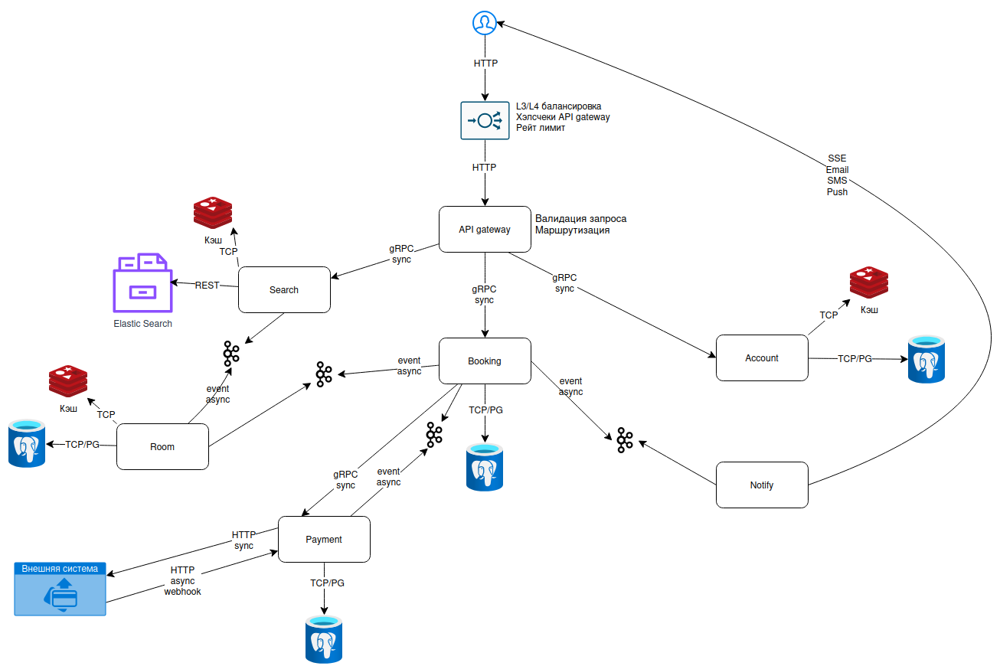

# ДЗ 2. Проектирование взаимодействия сервисов — решение

## Выбранная система

Cервис бронирования

## 1. Декомпозиция

- API Gateway - единая точка входа для всех клиентов. Выполняет валидацию запросов, маршрутизацию по сервисам, а также реализует старт трассировки запросов.
- Account - управляет учетными записями пользователей: регистрацией, авторизацией, хранением профиля и персональных данных. Может предотавлять информацию о пользователе другим сервисам.
- Search - отвечает за поиск и фильтрацию отелей. Выполняет запросы к поисковому индексу, кэширует популярные запросы и не изменяет бизнес-данные.
- Room - хранит информацию об отелях, номерах, тарифах и доступности на конкретные даты. Предоставляет сведения о свободных номерах и публикует события об изменениях для обновления поискового индекса.
- Booking - оркестрирует процессом бронирования. Проверяет доступность номера через Room, создает запись о бронировании, инициирует оплату и публикует события для других сервисов после успешного завершения операции.
- Payment - интегрируется с внешними платежными системами, инициирует платежи и обрабатывает webhook-уведомления об их статусе. Обеспечивае идемпотентнось операций и сохраняет информацию о проведенных транзакциях.
- Notify - отвечает за доставку уведомлений пользователям. Получает события из MQ и отправляет Email, SMS или пуш-уведомления.

В рамках данного системного дизайна и декомпозиции умышленно не рассматриваются:

- CDN;
- Интеграции с почтовыми/SMS системами;
- Кэширующий слой;
- Реализация MQ.

## 2. Протоколы

### Входящий трафик от пользователя

Протокол: HTTP(S)

Почему:
браузеры и мобильные клиенты. Можно было бы для мобильных клиентов предложить gRPC, но по предварительным рассчетам оценили так, что единообразие нам приоритетнее.

### API Gateway и внутренние сервисы (Booking, Account, Search)

Протокол: gRPC

Внутренние сервисы принадлежат одной инфраструктуре.

Почему:

- HTTP/2 мультимлексирование, выигрываем на TCP хэндшейах при немалом количестве соединений;
- protobuf вместо JSON: меньше трафика, быстрее сериализация, строгие контракты

### Сервисы и Postgresql

Везде постгресовый протокол поверх TCP. Нативно.

### Search и Elasticsearch

REST, нативная реализация от ES.

### Redis и сервисы

RESP поверх TCP, нативая реализация.

### Notify и пользователи

Выбран SSE в связи с тем, что оповещения односторонние, рационально экономим на реализации.

### Payment и Внешняя система платежей

Синхронный инициирующий запрос от нас в сторону внешней системы, и далее будем ожидать вебхук асинхронно по HTTP. Асинхронно, так как ответ может вернуться через неопределенное время. Стандартный паттерн взаимодействия с платежной системой. Никакого брокера в данной ситуации (при типичном раскладе) бывть не может.

## 3. Схема взаимодействия

## 4. API-контракты

Описал API в diagrams/api.yaml

## 5. Асинхронность

В качестве менеджера очередей для обмена событиями выбрана Kafka. Нам не нужна очень хитрая логика маршрутизации сообщений, но гибкое и простое масштабирование понадобится.
Асинхнронное взаимодействие на указанных сервисах выбрано в связи с тем, что семантика взаимодействия не предполагает получение результата здесь и сейчас. Плюс ко всему есть ситуации, когда одно сообщение предполагается для нескольких получателей. Так же понижаем связность между сервисами всей платформы.

Возможно, анинхронное взаимодействие нужно принести и между ES и Search, добавив Logstash, но тут автор ещё не определился.

## 6. Паттерны

### Outbox

Делаем везде, где у нас событийность (отдельная табличка в БД этого сервиса). Защищаемся от проблем с Kafka, от потери событий. С дальнейшей обработкой строк из Outbox таблички будет работать сам сервис, который туда и записал.

### CQRS

Везде, где у нас РСУБД, разделим RO и RW по разным инстансам (или через LB) этой же СУБД (мастер, слейв, репликация).
При наличии аналитических сервисов данные для них мы могли бы складывать в более подходящие для OLAP СУБД, например Clickhouse, и тогда забиралибы аналитику из CH.

### Saga

В Booking можно реализовать Saga для ситуаций бронирования. Если бронь есть, а с оплатой проблема, то бронирование нужно компенсировать (откатить)
