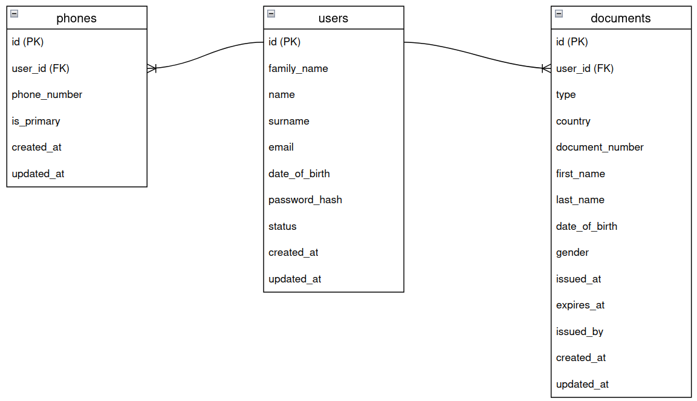
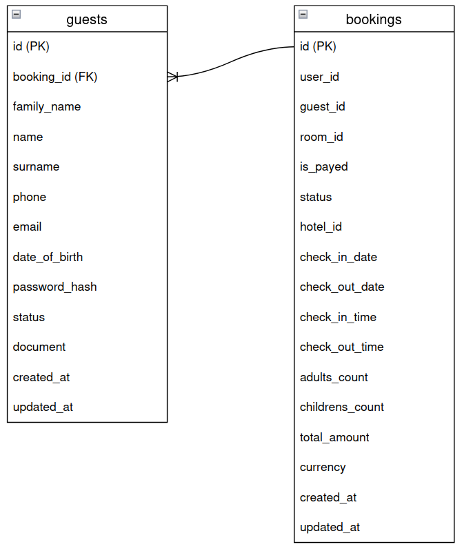
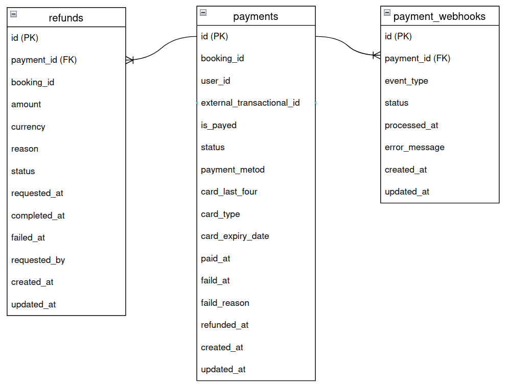
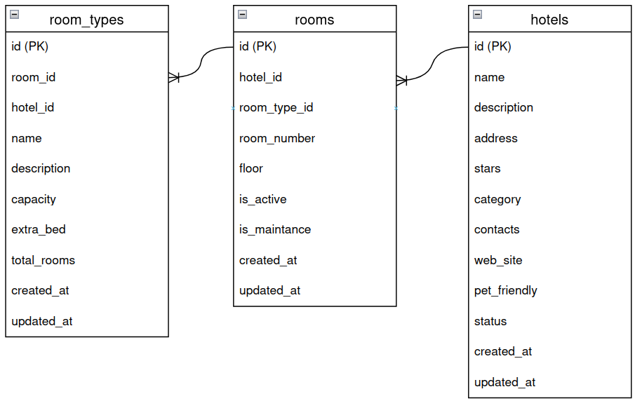

# ДЗ 3. Проектирование хранения данных — решение

## 1. Модель данных

### Account

### Booking

### Payment

### Room

### Search

Сервис использует документоориентированную СУБД ElasticSearch. В индексе хранит данные из сервиса Room (номера, типы номеров, отели, тарифы). Индекс имеет статический мапинг полей, стремящийся повторить структуру таблиц Room сервиса.

## 2. Выбор БД

Для основных сервисов (Account, Booking, Payment, Room) я выбираю в качестве слоя хранения реляционную СУБД.
В перечисленных сервисах нам крайне важна согласованность и строгая типизация, в общем, ACID. При этом мы хотим иметь возможность гибко управлять схемой, и меть возможность делать сложные запросы к данным.
В связи с нагрузками у нас будет постоянный конкурентный доступ, поэтому нам важем механизм MVCC.
Учитывая описанное я выбрал для описанных сервисов Postgresql. Данная реализация покрывает все требования, а так же предлагает широкий спектр расширений, если чего-то не будет хватать в будущем (как говорит Олег Бартунов, "Postgres - это универсальная база данных"). Так же PG имеет проверенные возможности для скейлинга (как минимум, RO скейлим через простые реплики, как максимум есть возможность делать кластеры, например Patroni).
Можно было бы посмотреть в сторону Mysql/Mariadb, но в контексте универсальности она не будет такой гибкой, и не так мощно поддерживает работу с JSON. При этом с Mysql можно получить более нативный вариант скейлинга RW (мастер-мастер).

Для сервиса Search в качестве слоя хранения я выбрал Elasticsearch.
Elasticsearch построен на базе инвертированных индексов Apache Lucene. Эта структура оптимизирована для полнотекстового поиска (который нам тут и нужен), она позволяет мгновенно находить документы по отдельным словам и фразам, что критически важно для поисковых запросов, вводимых пользователем. Итого, быстрый поиск и релевантный.
ES из коробки умеет горизонтально масштабироваться, а так как данных будет много, нам это только на руку. Так же ES умеет работает с слоями данных (горячие, теплые, холодные), что позволит нам иметь потенциал для оптимизации в долгосрочном хранении данных.
Благодаря наличию инструмента Kibana мы имеем мощный инструмент для администрирования и аналитики.

## 3. Шардирование

### Первым кандидатом на шардирование будет Booking

- Объем данных растет экспоненциально;
- Нагрузка и на запись, и на чтение высокая;
- Исторические данные (архив броней) занимают много места.

| Сервис | Что шардируем | Ключ | Стратегия | Кол-во шардов (старт) | Ребалансировка | Главный риск + как лечим |
|---|---|---|---|---|---|---|
| Booking | Таблица bookings | user_id | hash | 4 | Consistent hashing | "Горячий" шард |

### Почему hash-шардирование по user_id

Большая часть запросов в Booking:

- Показать все брони пользователя;
- Проверить брони пользователя в конкретные даты;
- Отменить бронь по ID.

При hash-шардировании по user_id все эти запросы идут в один шард, что дает максимальную производительность.

### Ребалансировка

При добавлении новой ноды осуществится миграция только меньшей части данных (мигрирует только ~1/N) на новую ноду, новые данные тоже начнут маршрутизироваться на неё. Это происходит за счет Consistent hashing, реализованного в приложении изначально (на этапе проектирования).
Простой при ребалансировке исключаем за счет двойной записи на время её процесса (пишем в текущий и новый шард, а далее избавимся от данных на текущем шарде).

### Снижение рисков "горячего" шарда

- Для начала мониторинг (выявление "горячего");
- Составной ключ шардирования (user_id + hotel_id);
- Вместо одного шарда на пользователя создаем виртуальные шарды внутри одного физического (логика приложения).

## 4. Кэширование

| Что кэшируем | Уровень | Стратегия | TTL | Инвалидация | Зачем (выигрыш) |
|---|---|---|---|---|---|
| **Account** |
| Профиль пользователя (`user:{id}`) | Redis (app) | Cache-Aside | 10 мин | По событию `user.updated` | Снизить нагрузку на БД при каждом запросе авторизации/роверки данных |
| Сессия пользователя (`session:{token}`) | Redis (app) | Write-Through | Время жизни сессии (7 дней) | При logout/истечении TTL | Обеспечить быструю проверку аутентификации без обращения к БД |
| **Room** |
| Карточка отеля/номера (`hotel:{id}`, `room:{id}`) | Redis (app) | Cache-Aside | 1 час | По событиям `hotel.updated`, `room.updated` | Снизить нагрузку на БД при просмотре страниц отелей |
| Результаты поиска (по гроду/датам) | Redis (app) | Cache-Aside | 5–10 мин | По событиям `room.availability_updated`, `room.price_changed` | Ускорить выдачу частых поисковых запросов без тяжёлых запросов в БД |
| **Search** |
| Результаты полнотекстового поиска (`search:{query_hash}`) | Redis (app) | Cache-Aside | 3–5 мин | По событиям обновления данных (Room) | Снизить нагрузку на Elasticsearch, ускорить отклик для повторяющихся запросов |
| **Booking** |
| Активные/последние брони пользователя (`user:{id}:bookings`) | Redis (app) | Cache-Aside | 5 мин | По событиям `booking.created`, `booking.updated`, `booking.cancelled` | Ускорить отображение истории броней в личном кабинете без частых запросов к БД |

Мы не рассматривали CDN для нашей системы, но всё же дополню, что в кэшировании медиа статики смысл может быть, чтобы решить вопросы более быстрого получения фото/видео по отелям из разных городов/стран.

## 5. Очереди

Брокер применяем везде, где пользователь не ожидает ответа сервиса, а ожидает он при авторизации (Account), при любом поиске (Search), и при начале бронирования (Booking). В остальных межсервисных взаимодействиях можем позволить себе асинхронный подход.
В качестве реализации брокера выбираем Kafka. Кластер. При необходимости наращиваем количество нод.
Нам достаточно топиков без хитрой маршрутизации, функциональности Kafka хватает.

## 6. CAP trade-offs

- строгость для платежей и консистентность для броней (CP);
- скорость и доступность для пользовательского опыта (AP).

---

Чтобы не усложнять архитектуру шардированием на уровне БД, можно использовать CQRS (потолок будет, но оттянем):

- Запись: все брони пишутся в одну один инстанс (мастер);
- Чтение: создаются RO реплики
- Архивные данные: старые брони выносятся в отдельное хранилище (например, ClickHouse для аналитики и выборки по историчеким данным).
